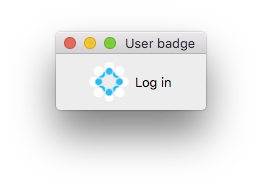
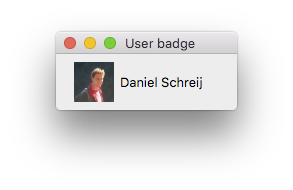
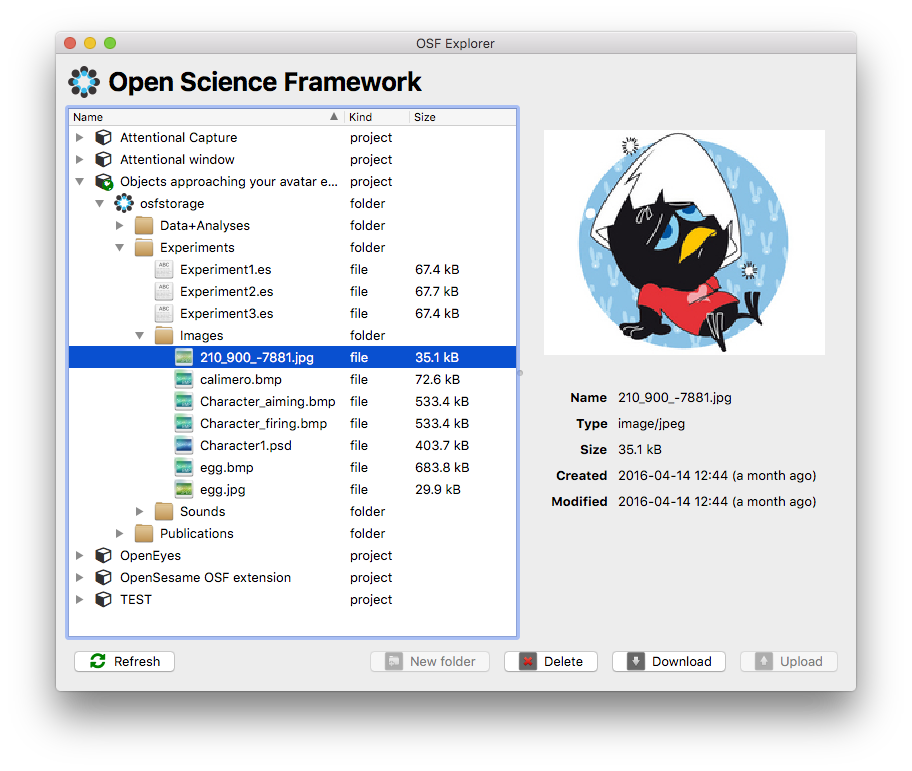

# Components

## User badge

The User Badge is the widget through which the user can log into and out of the OSF. When no user is logged in, the badge shows the OSF/COS logo and contains a login button. When a user is logged in, the logo is replaced by the user's profile picture (from OSF) and the login button becomes a dropdown menu offering the user several actions to interact with the OSF, among which logging out again.

## Login Window

When the user clicks the log-in button in the user badge, a simple browser window pops up displaying the login page of the OSF. The window is automatically closed after a succesful log-in.

## Project Tree

The project tree shows the projects, repositories and their files and folders in a hierarchical tree view. The project tree on its own does not really offer any functionality (except for the presentation of the data) and should therefore be embedded in another widget which implements ways to interact with the OSF through the project tree (which is exactly what the OSF explorer does)

## OSF Explorer

The OSF Explorer embeds the project tree, and offers options to interact with your projects on the OSF and their contents. It is for example possible to download or upload files, delete files and folders, create new folders. The explorer furthermore creates context menus for the different types of tree items that are present for further ways of interacting with all your files on the OSF.

